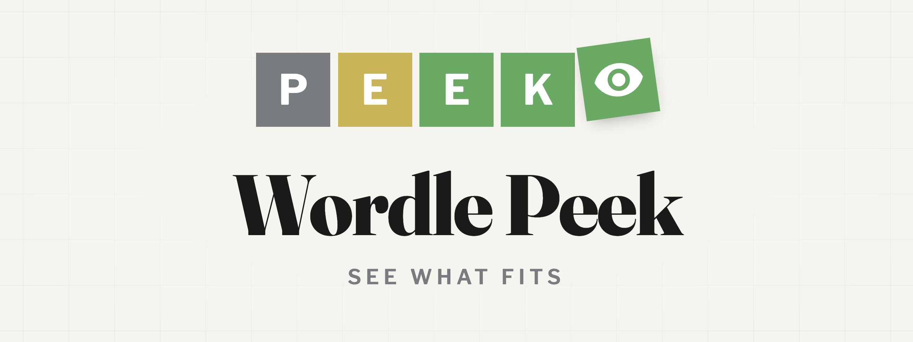
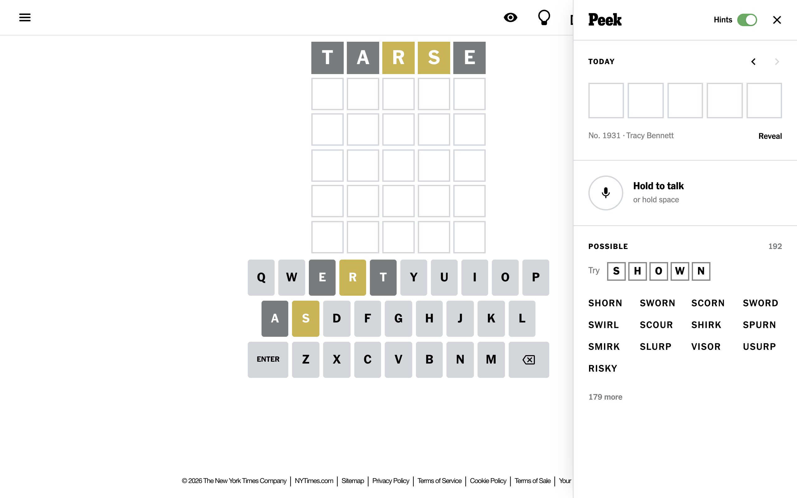

<p align="center">
  
</p>

A Chrome extension for Wordle. It shows every word that still fits your board, suggests a strong next guess, and keeps today's answer one tap away.

<p align="center">
  
</p>

## Features

- **Possible words.** Every answer that still fits your guesses, updated as you play. Tap one to enter it.
- **Next guess.** A suggested word that narrows things down the most. Following it solves in 3.4 guesses on average.
- **The answer.** Hidden until you tap it. Works on past puzzles too.
- **Voice.** Hold the mic, or hold space, and say a word. Speech recognition runs on your device.
- **Hints switch.** Turn it off to hide the answer and word lists and keep just the voice and puzzle controls.
- Follows the game's light, dark, and high contrast themes.

## Install

[Download the latest release](https://github.com/Ammaar-Alam/wordle-peek/releases/latest), unzip it, then:

1. Open `chrome://extensions` (or `arc://extensions`).
2. Turn on **Developer mode**.
3. Choose **Load unpacked** and select the unzipped folder.

Open [Wordle](https://www.nytimes.com/games/wordle/index.html) and click the eye in the game's header, or the extension's toolbar icon.

## How it works

- The board is read from the page and scored with Wordle's own rules, including repeated letters.
- The suggestion is the guess with the most expected information over the remaining answers, drawn from all 14,855 valid guesses once the field is small. Opening order is precomputed by `build.js`, so the empty board costs nothing.
- The answer comes from the same endpoint the game uses to load each puzzle.
- Voice uses [Vosk](https://alphacephei.com/vosk/) compiled to WebAssembly with a grammar limited to Wordle words, so it only ever hears valid guesses. Nothing leaves the browser.

## Development

No build step. Load the repository folder as an unpacked extension.

```bash
node test.js    # scoring and solver checks
node build.js   # re-sort words.js after changing the word lists
```

To package a release:

```bash
zip -r wordle-peek.zip manifest.json background.js content.js solver.js words.js icons voice
```

## Privacy

Wordle Peek has no server, analytics, or accounts, and it never sends audio anywhere. See the [privacy policy](PRIVACY.md).

## License

[MIT](LICENSE). The bundled speech library and model are Apache-2.0, see [voice/NOTICE](voice/NOTICE).

Wordle Peek is an independent project, not affiliated with or endorsed by The New York Times. Wordle is a trademark of The New York Times Company.
